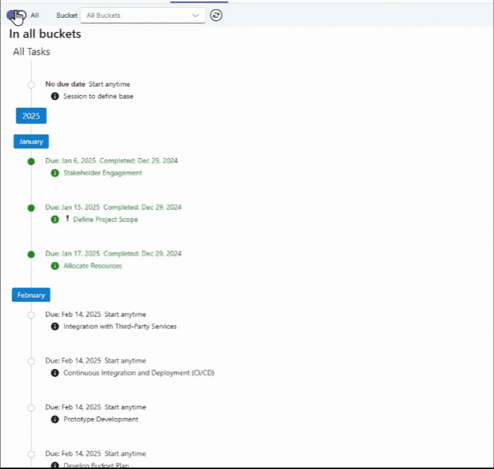
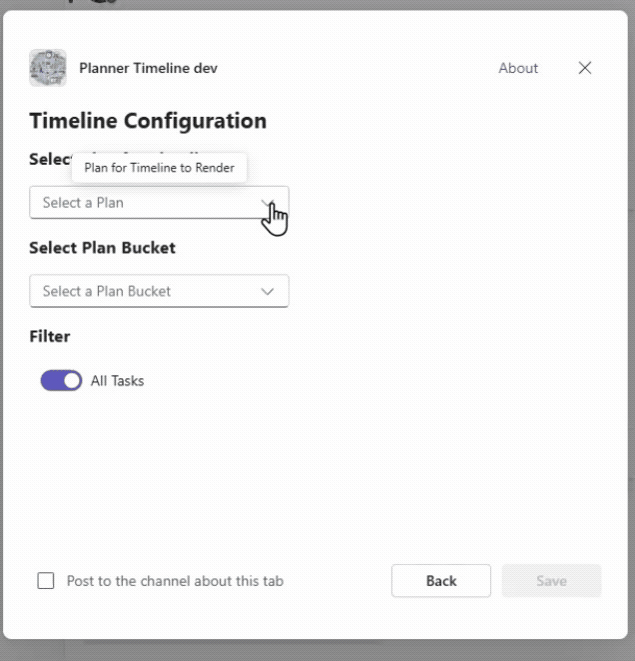

# M365 Planner Timeline Tab

## Table of Contents

- [Summary](#summary)
- [Tools and Frameworks](#tools-and-frameworks)
- [Prerequisites](#prerequisites)
- [Version history](#version-history)
- [Disclaimer](#disclaimer)
- [Features](#features)
- [Minimal path to awesome](#minimal-path-to-awesome---debug-against-a-real-microsoft-365-tenant)
- [Help](#help)
- [How to Deploy Azure](#how-to-deploy-azure)
- [References](#references)
---
## Summary

The purpose of this sample Teams Toolkit Tab is to render the buckets of tasks for a M365 Group's Planner.
 It implements single sign-on authentication and access Plan Buckets and Tasks via Microsoft Graph.
 The timeline is rendered in task due date order with tags for years and months.

- This sample was generated with Teams Toolkit as a "Tab => React with Fluent UI => Typescript".
- React Hooks is used in a Restify web app.
- The Azure Function is not needed and has been deleted from the sample.

### **Task details popup**
    

## Tools and Frameworks

_Teams Toolkit pulls in some standard libraries and SDK's to Create React App. Since these are aligned with Teams Toolkit versions._

_To access the Planner data the "Microsoft Graph Types" are used_

## Prerequisites

> - A [Microsoft 365 account for development](https://docs.microsoft.com/microsoftteams/platform/toolkit/accounts)
> - Admins Access to a Office 365 tenant
> - [Node.js](https://nodejs.org/), supported versions: 18, 20
> - Set up and install Teams Toolkit for Visual Studio Code v5.0 [How to install Teams Toolkit v5.0](https://learn.microsoft.com/en-us/microsoftteams/platform/toolkit/install-teams-toolkit?tabs=vscode).
> - [Set up your dev environment for extending Teams apps across Microsoft 365](https://aka.ms/teamsfx-m365-apps-prerequisites)
>   Please note that after you enrolled your developer tenant in Office 365 Target Release, it may take couple days for the enrollment to take effect.
> - [Teams Toolkit Visual Studio Code Extension](https://aka.ms/teams-toolkit) version 5.0.0 and higher or [Teams Toolkit CLI](https://aka.ms/teamsfx-toolkit-cli)

1. First, select the Teams Toolkit icon on the left in the VS Code toolbar.
2. In the Account section, sign in with your [Microsoft 365 account](https://docs.microsoft.com/microsoftteams/platform/toolkit/accounts) if you haven't already.
3. Press F5 to start debugging which launches your app in Teams using a web browser. Select `Debug in Teams (Edge)` or `Debug in Teams (Chrome)`.
4. When Teams launches in the browser, select the Add button in the dialog to install your app to Teams.

## Version history

Version|Date|Author|Comments
-------|----|----|--------
1.6.0|January 15, 2025|Bill Brockbank|Initial release

## Disclaimer

**THIS CODE IS PROVIDED *AS IS* WITHOUT WARRANTY OF ANY KIND, EITHER EXPRESS OR IMPLIED, INCLUDING ANY IMPLIED WARRANTIES OF FITNESS FOR A PARTICULAR PURPOSE, MERCHANTABILITY, OR NON-INFRINGEMENT.**

## Features

- React with Fluent UI Web application.
- Access the Planner buckets and task via Microsoft Graph in the Web app (not through a Azure function)
- Filter task by active or all tasks including completed.
- Filter task by plan bucket.
- Tasks status rendered in colors:

    Color | Status | Criteria 
    ----------|------------|--------------------------------
    **Red** | Overdue | Passed Due Date
    **Green** | Complete | Progress set to "Completed"
    **Blue** | In progress| Progress set to "In Progress"
    **Black** | Not Due | Progress set to "Not Started"

- Refresh Planner Tasks then re-rending with the selected filter settings.
- With Teams desktop or in a web browser Plan Task and filter settings cached in the browser session Storage.
- By clicking on the (i) the task details are rendered.
- The tab has been configured to support Teams mobile App.
- It support both Teams dark and light mode.

---

## Minimal path to awesome - Debug against a real Microsoft 365 tenant

- Clone repo
- Open repo in VSCode
- First, select the Teams Toolkit icon on the left in the VS Code toolbar.
- In the Account section, sign in with your [Microsoft 365 account](https://docs.microsoft.com/microsoftteams/platform/toolkit/accounts) if you haven't already.
- Before running the Teams Tab code, you need to copy the following file in the "env" folder:
>>- .env.local.sample --> ,env,local
>>- .env.local.user.sample --> .env.local.user
- Press <kbd>F5</kbd> to start debugging which launches your app in Teams using a web browser. Select `Debug (Edge)` or `Debug (Chrome)`.
- When Teams launches in the browser, select the Add button in the dialog to install your app to Teams.
- Wait for deploy and provision tasks to complete.
- The first time you run the code you will need to "Authorize permission to access Planner Tasks" 
    

        
    

- On initial app run, Allow the following Graph API permissions via the consent prompt.   <mark>Make sure popups are allowed in the browser to see the consent prompot</mark>.

    >|Graph API Permissions|
    >|-|
    >|User.Read.All|
    >|Tasks.Read|
    >|GroupMember.Read.All|
    >|Tasks.ReadWrite|
    >|TeamSettings.Read.All|

    

- The Planner Timeline renders the a Plan in the group of Teams of the Channel added to.
- Can be added for different plans and buckets in any of the Teams Channels.

    

## How to Deploy Azure

___To deploy "Planner Timeline" into Azure see the following:___
- Microsoft Teams Developer Resurces: [Deploy Microsoft Teams app to the cloud using Microsoft Visual Studio Code](https://learn.microsoft.com/en-us/microsoftteams/platform/toolkit/deploy)
- Microsoft Learn Training module: [Deploy a Microsoft Teams app to Azure by using Teams Toolkit for Visual Studio Code](https://learn.microsoft.com/en-us/training/modules/teams-toolkit-vsc-deploy-apps/)

## Help

We do not support samples, but this community is always willing to help, and we want to improve these samples. We use GitHub to track issues, which makes it easy for  community members to volunteer their time and help resolve issues.

You can try looking at [issues related to this sample](https://github.com/pnp/teams-dev-samples/issues?q=sort%3Aupdated-desc+is%3Aissue+is%3Aopen) to see if anybody else is having the same issues.

If you encounter any issues using this sample, [create a new issue](https://github.com/pnp/teams-dev-samples/issues/new).

Finally, if you have an idea for improvement, [make a suggestion](https://github.com/pnp/teams-dev-samples/issues/new).

---

## References

- [Teams Toolkit Documentations](https://docs.microsoft.com/microsoftteams/platform/toolkit/teams-toolkit-fundamentals)
- [Teams Toolkit CLI](https://aka.ms/teamsfx-toolkit-cli)
- [Microsoft Graph TypeScript Types](https://github.com/microsoftgraph/msgraph-typescript-typings/blob/main/README.md)
- [Microsoft Teams SDK](https://learn.microsoft.com/en-us/javascript/api/overview/msteams-client?view=msteams-client-js-latest&tabs=npm)
- Host your app in Azure by [provision cloud resources](https://learn.microsoft.com/microsoftteams/platform/toolkit/provision) and [deploy the code to cloud](https://learn.microsoft.com/microsoftteams/platform/toolkit/deploy)
- [Teams Toolkit Samples](https://github.com/OfficeDev/TeamsFx-Samples)

---

